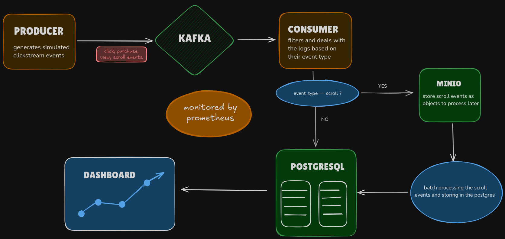
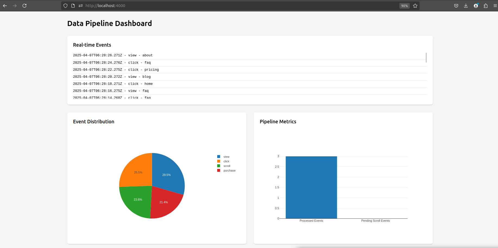

# Real-time Data Pipeline

this is a basic pipeline that captures clickstream events on a website and stores them in a database. it also provides a dashboard to visualize the events. and metrics to monitor the pipeline.



## Local Setup

### Prerequisites
- Docker and Docker Compose
- Node.js (v14 or higher)
- npm

### Installation & Setup

run docker containers using following command:

```bash
docker-compose up --build
```
## 📊 Visualization

### Dashboard

The dashboard provides real-time statistics and visualizations of the event data.

Dashboard is available at http://localhost:4000



## 📈 Monitoring & Logs

### Logs
Logs can be accessed by running:

```bash
docker-compose logs -f node-app
```

### Metrics by prometheus
Metrics is available at http://localhost:4000/metrics-ui


